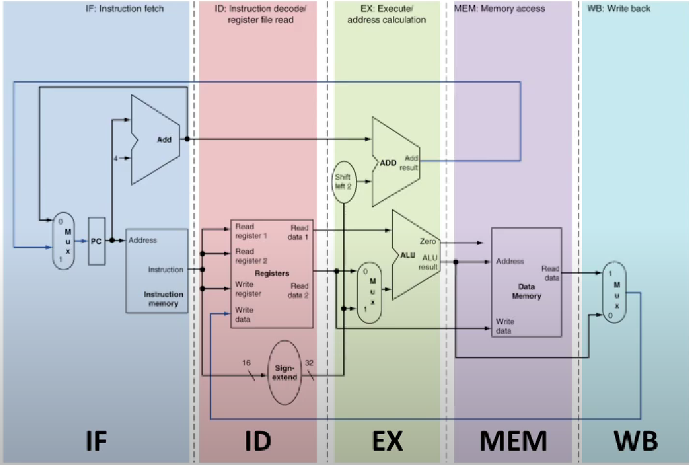

# The Enduring Applicability of MIPS Architecture in Modern Computing
## *TABLE OF CONTENTS*
 1.*MIPS* 
 2.*TYPES of MIPS Instruction* 
 3.*Stages of MIPS instruction* 
 4.*Operations of MIPS Language* 
 5.*Companies Exercising MIPS Language* 
 6.*Advantages of MIPS over High-Level Languages* 
 7.*Disadvantages of MIPS Compared to High-Level Languages* 

### *MIPS*
*MIPS (Microprocessor without Interlocked Pipeline Stages) processors are a family of RISC (Reduced Instruction Set Computing) processors.* 

*MIPS (Microprocessor without Interlocked Pipeline Stages) architecture, despite the proliferation of high-level programming languages, continues to hold significance in various computing disciplines. This composition delves into the reasons behind its continued operation, exploring its structure, operations, advantages, disadvantages, and notable adopters.* 

### *TYPES of MIPS Instruction*
*MIPS assembly language comprises different instruction types, especially* 
- *R-Type (Register type):* *Used for calculation, logical, and shift operations where all operands are located in registers.*

MIPS program to perform arithmetic operations with registers and store the result
    
    .data
    result: .space 4     # Space for result

    .text
    
    li $t0, 10           # Load immediate value 10 into $t0
    li $t1, 5            # Load immediate value 5 into $t1
    li $t2, 3            # Load immediate value 3 into $t2

    
    add $t3, $t0, $t1    # Add $t0 and $t1, store result in $t3
    sub $t4, $t3, $t2    # Subtract $t2 from $t3, store result in $t4
    mul $t5, $t4, $t2    # Multiply $t4 and $t2, store result in $t5
    div $t5, $t5, $t2    # Divide $t5 by $t2, store result in $t5

    sw $t5, result        # Store the result in memory
    li $v0, 10           # Exit syscall code
    syscall

- *I-Type (Immediate type):* *Used for data transfer and immediate operations where one operand is an immediate value.* 

MIPS program to add an immediate value to a register and store the result
    
    .data
    result: .space 4     # Space for result

    .text
   
    li $t0, 10           # Load immediate value 10 into $t0
    addi $t1, $t0, 5     # Add immediate value 5 to $t0 and store in $t1
    sw $t1, result       # Store the result in memory
    li $v0, 10           # Exit syscall code
    syscall
 

- *J-Type (Jump type):* *Primarily used for control transfer operations, such as unconditional jumps.* 

MIPS program to perform programs with transfer operations, such as unconditional jumps.
    
    .text
    
    li $t0, 10           # Load immediate value 10 into $t0
    li $t1, 5            # Load immediate value 5 into $t1
    li $t2, 3            # Load immediate value 3 into $t2

    add $t3, $t0, $t1    # Add $t0 and $t1, store result in $t3
    sub $t4, $t3, $t2    # Subtract $t2 from $t3, store result in $t4

    bltz $t4, negative    # Branch to 'negative' if $t4 < 0

    move $t5, $t4         # Move $t4 (positive result) to $t5
    j end                 # Jump to 'end'

    negative:
    sub $t5, $zero, $t4   # Negate $t4 and store in $t5

    end:
    li $v0, 10            # Exit syscall code
    syscall
'''

*These instructions form the base of MIPS programs, offering a low-level yet important approach to programming. The structure of MIPS instructions generally includes an opcode, source operands, and destination operand, easing precise control over processor behavior.* 

### *Stages of MIPS instruction* 
 *1.Fetch: Get the next instruction from memory.* 
 *2.Decode: Understand the instruction and get necessary data.* 
 *3.Execute: Perform the operation specified by the instruction.* 
 *4.Memory Access: If needed, access memory (e.g., for load/store instructions).* 
 *5.Write Back: Store the result in the appropriate register.* 
 *These stages allow for efficient processing of multiple instructions simultaneously, improving overall performance.* 

 

[Watch a video explanation](https://www.youtube.com/watch?v=pKZkQOo-xVE)

### *Operations of MIPS Language* 
*MIPS language finds operations in different disciplines, including embedded systems, networking, digital signal processing, and educational settings. Its effectiveness in handling low-level tasks, such as device drivers and real-time processing, makes it necessary in these fields.* 

### *Uninterrupted Operation Amid High-Level Languages* 
 *Despite the popularity of high-level languages like C, C++, and Java, MIPS remains applicable due to several factors. Companies and institutions employing MIPS constantly bear direct attack control, performance optimization, or heritage system conservation, tasks for which high-level languages may not be suitable.* 

### *Companies Exercising MIPS Language* 
*Prominent companies exercising MIPS architecture include Broadcom, Huawei, and Imagination Technologies. These enterprises use MIPS for various purposes, such as developing network routers, IoT devices, and multimedia processors.* 

 *1.Broadcom: Broadcom has been known to use MIPS architecture in networking hardware, such as routers and switches. MIPS processors offer efficiency and performance advantages in these devices, making them suitable for handling network traffic and packet processing.* 

 *2.Huawei: Huawei has incorporated MIPS processors in some of its products, particularly in telecommunications infrastructure and networking equipment. MIPS architecture provides the necessary performance and flexibility for Huawei's networking solutions.* 

 *3.Imagination Technologies: Imagination Technologies, the company behind MIPS architecture, continues to develop and optimize MIPS processors for a range of applications. While not a user in the traditional sense, Imagination Technologies plays a crucial role in advancing MIPS technology and supporting companies that utilize MIPS architecture in their products.* 

### *Advantages of MIPS over High-Level Languages* 
 *1. Effectiveness: MIPS enables fine-grained control over attack resources, performing in largely optimized law and bettered performance.* 
 *2. Low-Level Access: With MIPS, formulators can directly manipulate attack factors, piercing features not readily available in high-level languages.* 
 *3. Real-Time Processing: MIPS excels in operations taking deterministic execution and low-quiescence responses, such as real-time systems and embedded devices.* 

### *Disadvantages of MIPS Compared to High-Level Languages* 
 *1. Steep Learning Curve: Programming in MIPS assembly requires a deep understanding of computer architecture, posing a barricade to entry for novice formulators.* 
 *2. Portability: MIPS law is constitutionally tied to specific attack architectures, limiting its portability across different platforms.* 
 *3. Development Time: Writing and remedying MIPS assembly law can be time-consuming compared to advanced-level languages, impacting development cycles and time-to-request.* 

### Conclusion 
 *Despite the prevalence of high-level languages, MIPS architecture retains its connection in specialized computing disciplines due to its effectiveness, low-level access, and felicity for real-time processing. While high-level languages offer ease of development and portability, MIPS excels in scripts taking direct attack control and performance optimization. Companies and institutions continue to work MIPS for different operations, icing its continuing presence in the ever-evolving terrain of computing.*
 
